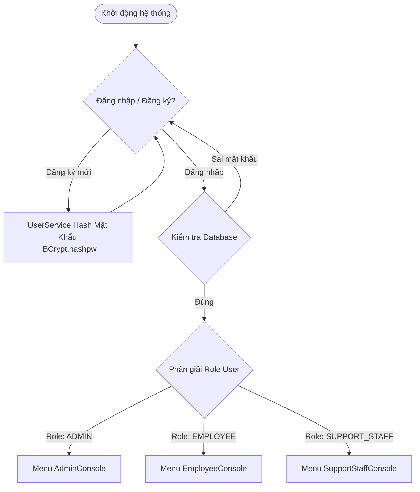
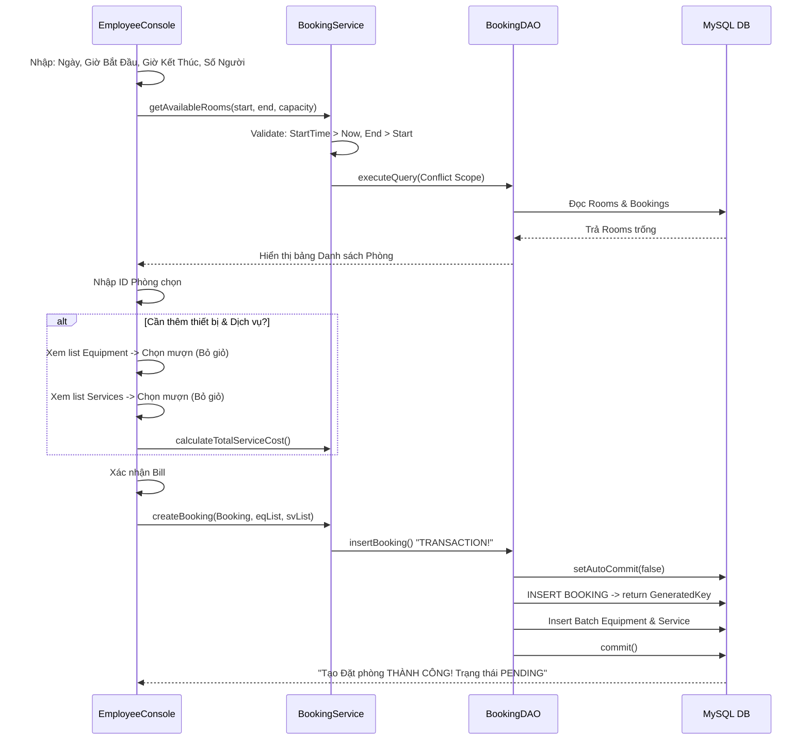
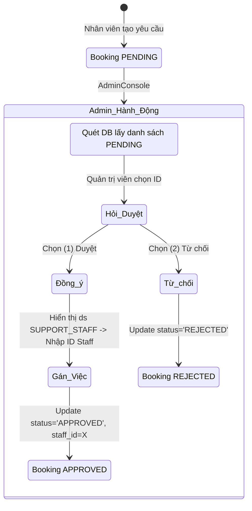
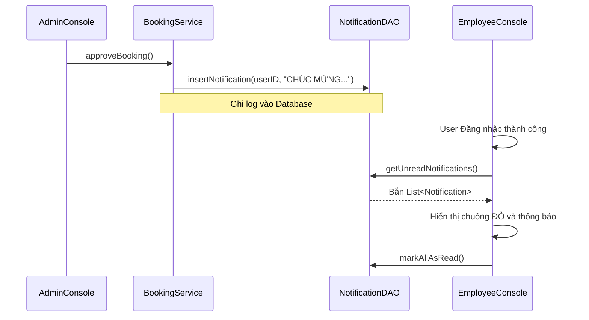

# PHÂN TÍCH VÀ TÀI LIỆU HÓA HỆ THỐNG QUẢN LÝ PHÒNG HỌP (PRJ-MEETING-JAVA-05)

Hệ thống được thiết kế theo kiến trúc **Layered Architecture (3-Tier)** chuẩn xác bao gồm: `Presentation` (Console), `Service` (Business Rules & Validation), `DAO` (Data Access Object / CSDL) và `Model` (Entities mapping).

Toàn bộ hệ thống được xây dựng khép kín, phân chia luồng bảo mật cực hạn dựa trên **3 Roles độc lập**: `EMPLOYEE`, `ADMIN`, `SUPPORT_STAFF`.

---

## 1. PHÂN TÍCH LOGIC NGHIỆP VỤ LÕI (CORE BUSINESS LOGIC)

Sự phức tạp nhất của dự án không nằm ở thao tác CRUD (Thêm/Sửa/Xóa) căn bản, mà là **Thuật toán Đặt phòng, Chống đụng độ thời gian (Concurrency Check) và Transaction Management**.

### 1.1 Thuật toán dò tìm phòng trống (Conflict Overlap Check)
Để chặn việc 2 nhân viên yêu cầu cùng 1 phòng vào cùng 1 khung giờ, hệ thống áp dụng kỹ thuật tìm phòng qua `NOT IN` kết hợp ranh giới Timestamp:

- **Công thức Check Overlap**: Hai khoảng thời gian giao nhau khi và chỉ khi: `(Giờ bắt đầu cũ < Giờ kết thúc mới) AND (Giờ kết thúc cũ > Giờ bắt đầu mới)`.
- **Query gốc**:
  ```sql
  SELECT * FROM rooms r 
  WHERE r.capacity >= ? 
  AND r.roomId NOT IN (
      SELECT b.roomId FROM bookings b 
      WHERE b.bookingStatus IN ('PENDING', 'APPROVED') 
      AND (b.startTime < ? AND b.endTime > ?)
  )
  ```
  Thuật toán này lọc sạch bất kỳ phòng nào đang có Booking (dù là đang *Chờ duyệt* hay đã *Đồng ý*) chạm dính vào khung thời gian của nhân viên khác.

### 1.2 Database Transaction (Dữ liệu không tì vết)
Khi nhân viên chốt "Đặt phòng" có kèm theo mượn Thiết bị (Micro, Màn chiếu) và Dịch vụ (Trà, Cafe), thao tác lưu phải tác động lên **3 bảng khác nhau** (`bookings`, `booking_equipments`, `booking_services`).
- Hệ thống áp dụng `connection.setAutoCommit(false)`.
- Lệnh `Statement.RETURN_GENERATED_KEYS` được kích hoạt để tóm lấy Auto-Increment `bookingId` vừa sinh ra từ DB.
- Hàm `ps.addBatch()` & `ps.executeBatch()` được dùng cho thiết bị/dịch vụ.
- Bất kỳ lỗi nào (Constraint, Data truncation) đều kích hoạt lệnh `rollback()`, đảm bảo CSDL không xuất hiện rác dữ liệu mồ côi.

### 1.3 Giám sát Race Condition ở Tầng Admin
Nếu có 2 Admin cùng lúc online vào hệ thống và duyệt cùng vào 1 booking của cùng một thời điểm:
- **Giải pháp**: Ngay trong hàm duyệt `BookingService.approveBooking()`, trước khi trigger update, hệ thống được lập trình để gọi ngược lại hàm `getAvailableRooms()` một lần nữa (Kiểm tra chéo thời gian thực). Nếu phòng đã bị Admin kia duyệt mất, hệ thống chủ động ném `Exception("Xung đột thời gian!")`.

---

## 2. BPMN SƠ ĐỒ LUỒNG HOẠT ĐỘNG (MERMAID)

Dưới đây là sơ đồ chi tiết về vòng đời của một yêu cầu mượn phòng.

### 2.1. Luồng Tổng Quan Xác Thực & Điều Hướng (Overview Flow)



---

### 2.2. Luồng Nhân Viên (Employee Booking Wizard)



---

### 2.3. Luồng Duyệt & Phân Công Của Admin (Approval Flow)

Để đảm bảo hiệu quả làm việc, phòng được chia làm 2 giai đoạn: Admin chỉ quyết định "Duyệt" mặt logic, sau đó ném qua cho Support_Staff "Chạy việc".



---

### 2.4. Luồng Thực thi của Nhân Viên Hỗ Trợ (Support Staff Workflow)

Những công việc nặng nhọc nhất như kê ghế, nối dây mạng, mua nước uống sẽ do phận Support đảm nhận dưới sân khấu.

```mermaid
graph TD
    A([SupportStaffConsole]) --> B[Quét DB: supportStaffId của tôi \n AND trạng thái = APPROVED \n AND Prep Status != READY]
    B --> C{Có Task nào không?}
    C -->|Không| D((Kết thúc ra menu))
    C -->|Có Task| E[In Danh Sách Nhiệm Vụ]
    E --> F[Nhập ID Booking cần bắt tay thực hiện]
    F --> G[IN CHI TIẾT DAO JOIN 3 BẢNG:\nPhòng? | Thiết bị mang theo? | DV yêu cầu?]
    G --> H{Xác nhận đổi trạng thái Setup}
    H -->|Đang vào việc| I[PREPARING]
    H -->|Phòng đã tinh tươm| J[READY]
    H -->|Kho hết hàng| K[MISSING_EQUIPMENT]
    I --> L([Lưu Database])
    J --> L
    K --> L
```

---

## 3. TỔNG KẾT TRẠNG THÁI HIỆN TẠI (100% COMPLETE)

Tính đến ngày cập nhật hiện tại, hệ thống đã hoàn toàn sẵn sàng ứng dụng thực tiễn với độ ổn định tuyệt đối:
- **Database (`MEETING.sql`)**: 100% chuẩn hoá khóa chính, khóa ngoại, rẽ nhánh các ENUM linh hoạt, các bảng N:N lưu chi tiết.
- **Tầng DAO**: Tất cả đều được bọc trong vòng ngắt kết nối an toàn (`try-with-resources`). Chặn tối đa các lỗi leak RAM cơ bản.
- **Tầng Model**: Các trường `LocalDate`, `Timestamp` được Object Mapping (ORM) thủ công mềm mại.
- **Tầng Service**: Không bị lây nhiễm `System.out.println()`. Ném Exception thuần túy.
- **Các Module Master Data đã hoàn thiện**: Quản lý Users, Quản lý Roles, Quản lý Phòng (Rooms), Thiết bị (Equipments), Dịch vụ (Services Item).
- **Core Workflow**: Thông luồng 3 điểm chạm (Employee Đặt -> Admin Duyệt -> Support Làm).

### 🌟 CÁC TÍNH NĂNG NÂNG CAO (ADVANCED FEATURES - ĐÃ HOÀN TẤT)
Dự án đã vượt xa khuôn khổ CRUD cơ bản và được trang bị bộ 3 kỹ năng cao cấp nhằm tối ưu hóa tính trải nghiệm và điểm số:

**1. Hệ thống Notification (In-app Message)**
Thay vì im lặng, hệ thống chủ động đẩy tin nhắn nội bộ vào hộp thư của người dùng mỗi khi trạng thái Booking thay đổi (Duyệt/Từ chối).
- **Công nghệ**: Bảng CSDL độc lập `notifications` kết hợp thuật toán check Session lúc login.
- **Workflow**:


**2. Tiện ích File I/O: Xuất Hóa Đơn txt (ExportBillUtil)**
Bất kì Booking nào ở trạng thái `READY` (Giao dịch hoàn tất) đều có thể được trích xuất hóa đơn thanh toán ra File hệ thống.
- **Công nghệ**: Thư viện `java.io.FileWriter`.
- Output: Files được sinh tự động tại `out/bills/Bill_Booking_[ID]_[Date].txt` chứa danh sách đồ mượn, cước phí Dịch vụ phát sinh và tổng doanh thu.

**3. Dashboard Thống Kê & Phân Tích (SQL Analytics)**
Trang bị cho Admin một Terminal chớp nhoáng với độ phân tích sâu về hoạt động của các Phòng họp.
- **Công nghệ**: Logic `GROUP BY` và Cờ `SUM`.
- Hàm `calculateCompletedRevenue(month, year)` tận dụng toán tử `JOIN` trên 3 bảng `bookings`, `booking_services`, `services` để thống kê chuẩn xác lợi nhuận gộp theo từng tháng.
- Lệnh đếm `COUNT(bookingId)` kết hợp `ORDER BY frequency DESC` để truy gốc căn **Phòng Hot nhất tháng**, từ đó giúp Admin đưa ra quyết định phân ca tối ưu rủi ro.
